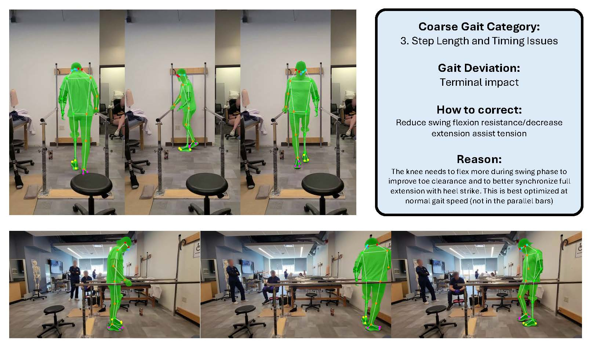

# ProGait: A Multi-Purpose Video Dataset and Benchmark for Transfemoral Prosthesis Users

This is the official repository for the paper ["ProGait: A Multi-Purpose Video Dataset and Benchmark for Transfemoral Prosthesis Users"](https://arxiv.org/abs/2507.10223) (ICCV'25).

## 🆕Updates
- **`2025/7/2`** We have published our dataset at Hugging Face: [Link to the dataset page](https://huggingface.co/datasets/ericyxy98/ProGait).
- **`2025/6/25`** Our paper "ProGait: A Multi-Purpose Video Dataset and Benchmark for Transfemoral Prosthesis Users" get accepted by ICCV'25! :tada: :tada: :tada:

## Table of Content
- [About ProGait](#what-is-progait)
- [Dataset](#progait-dataset)
- [Baseline models](#baseline-models)
- [Tasks](#tasks)
- [Evaluation](#evaluation)
- [How to cite](#how-to-cite)

## What is ProGait

ProGait is a multi-purpose video dataset aimed to support multiple vision tasks on prosthesis users, including Video Object Segmentation, 
2D Human Pose Estimation, and Gait Analysis. ProGait provides 412 video clips from four above-knee amputees when testing multiple 
newly-fitted prosthetic legs through walking trials, and depicts the presence, contours, poses, and gait patterns of human subjects with 
transfemoral prosthetic legs.

Example annotations:



## ProGait Dataset

### Download

- The raw videos and corresponding annotations is available [HERE](https://huggingface.co/datasets/ericyxy98/ProGait).
- Instructions for downloading can be found [HERE](https://huggingface.co/docs/hub/en/datasets-downloading). Use `huggingface-cli` for example:
    ```bash
    huggingface-cli download ericyxy98/ProGait --repo-type dataset --local-dir path/to/dataset
    rm -r path/to/dataset/.cache
    ```

### Annotation format

```
annotations
├── inside    <------------------ Scenario: inside parallel bars
│   ├── *_annotations.xml  <----- CVAT XML format
│   ├── *_keypoints.npy.gz  <---- 2D pose keypoints in format of numpy ndarray
│   ├── *_masks.npy.gz  <-------- Segmentation masks in format of numpy ndarray
│   └── *.txt  <----------------- Textual descriptions
└── outside   <------------------ Scenario: outside parallel bars
    └── ...
```
- The IDs are named in format of `<subject>_<prosthesis>_<trial>_<f(rontal)/s(agittal)>[_<additional round trips>]`. For example: `1_3_2_f` refers to the frontal view of Subject 1 using their 3rd prosthesis and having their 2nd walking trial; `2_6_2_s_2` refers to the sagittal view of Subject 2 using their 6th prosthesis and having their 2nd walking trial, specifically the 2nd additional round-trip (which is the 3rd overall).
- Pose keypoints have dimensions of ``(num_frames, num_keypoints, 3)``, where the 3 corresponds to x-, y-coordinates, and confidence scores. 
- Segmentation masks have dimensions of ``(num_frames, frame_height, frame_width, 1)``.
- NOTE: A single text description can apply to multiple video sequences within the same walking trial.

### Usage

1. **Clone the repository**
    ```bash
    git clone https://github.com/pittisl/ProGait.git
    cd ProGait
    ```
2. **Setup the virtual environment**
    ```bash
    conda env create -f environment.yml
    conda activate progait
    ```
3. **Prepare the dataset**
    - Download the dataset. See [above](#progait-dataset).
    - Place the data files under `datasets/progait/`, which should look like:
        ```
        .
        ├── datasets
        │   └── progait
        │       ├── annotations
        │       |   └── ...
        │       ├── previews
        │       |   └── ...
        │       ├── videos
        │       |   └── ...
        │       └── metadata.jsonl
        ├── scripts
        │   └── ...
        ├── models
        │   └── ...
        ├── README.md
        └── ...
        ```
4. **Run the demo**
    ```
    python verify_data.py
    ```

## Baseline models

- TBD

## Tasks

ProGait provides annotations for 3 different tasks:

#### Video Object Segmentation (VOS)
 - Bounding boxes and segmentation masks of the prothesis user

#### 2D Human Pose Estimation (HPE)
 - 23 pose keypoints of the target (17 for body and 6 for feet, following the [COCO-wholebody](https://github.com/jin-s13/COCO-WholeBody) definition)

#### Gait Analysis
 - Text descriptions of four key components:
    - The general gait category
    - The specific gait deviation
    - Recommendations on how to adjust the prosthesis to correct the gait
    - The reasons of these recommendations

## Evaluation


## Terms of Use

This project is released under the [MIT License](https://github.com/pittisl/ProGait/blob/main/LICENSE). 

## How to cite

If you find ProGait dataset useful for your project, please cite our paper as follows.

> Xiangyu Yin, Boyuan Yang, Weichen Liu, Qiyao Xue, Abrar Alamri, Goeran Fiedler, Wei Gao, "ProGait: A Multi-Purpose Video Dataset and Benchmark for Transfemoral Prosthesis Users", ICCV, 2025.

BibTeX entry:
```
TBD
```
